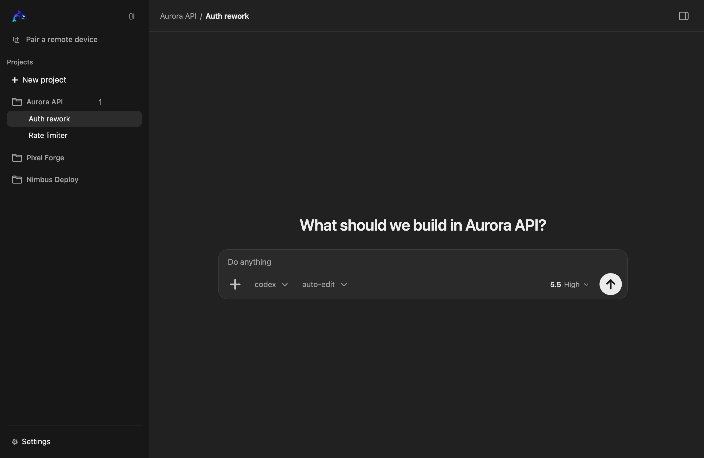
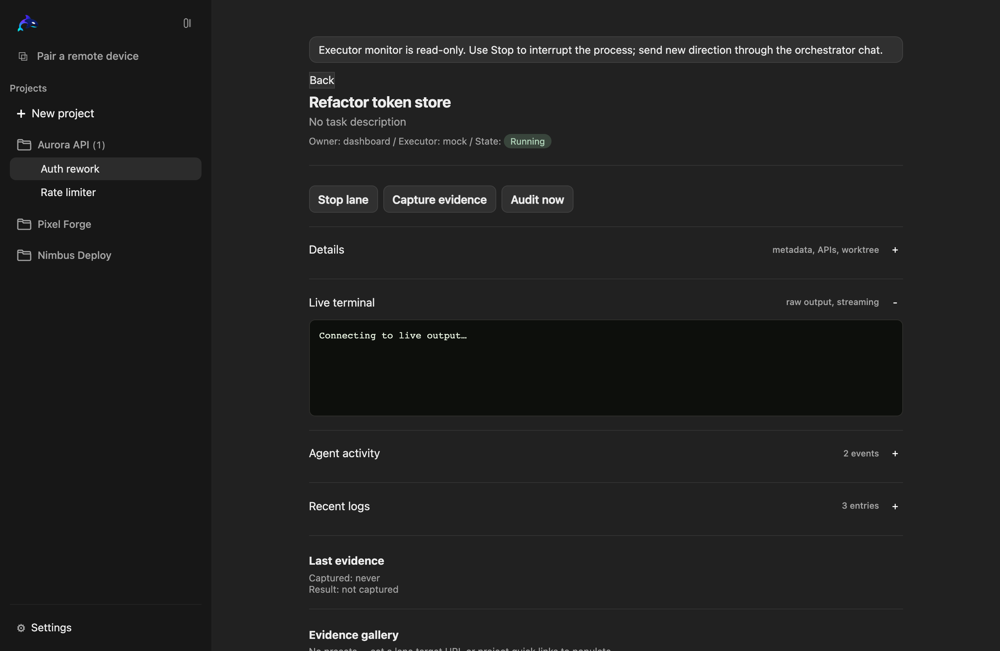
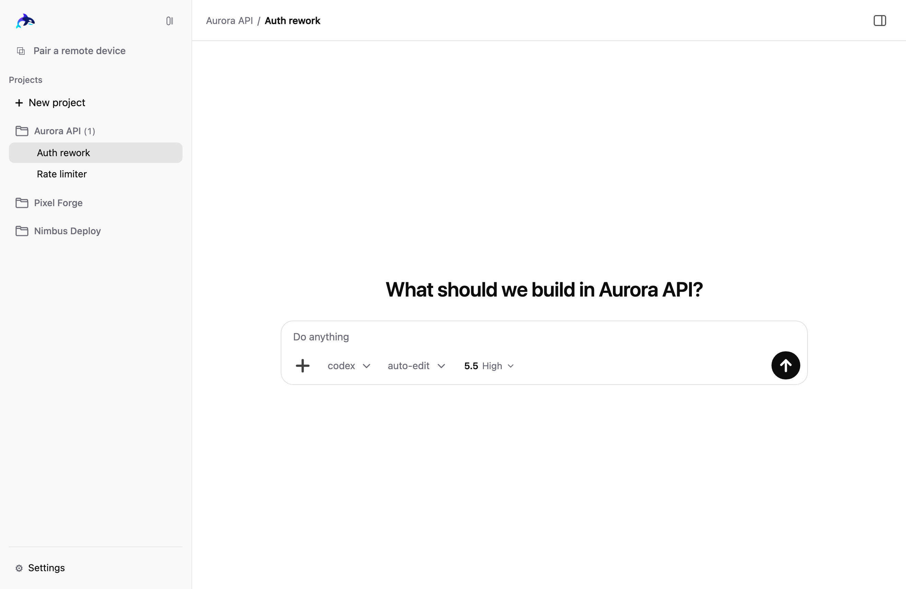
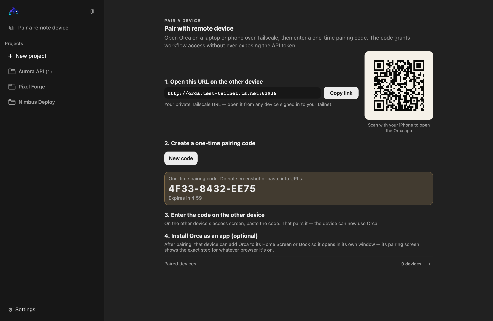
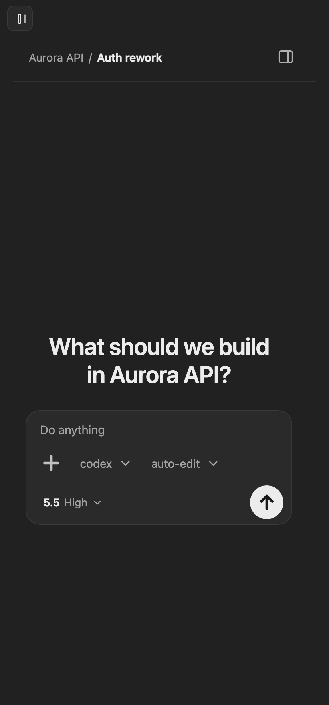

<div align="center">


# Orca

### Run your Codex & Claude coding agents across every project — from one calm dashboard, and from your phone.

Orca is a **local‑first, phone‑first control plane** for AI coding agents. Spin up
Codex, Claude, and API‑backed agent lanes across all your projects, watch them
work, capture evidence, and steer everything from a clean Codex‑style dashboard —
on your Mac, or from your phone over a private Tailscale link.

[](LICENSE)




</div>

---

## Why Orca

You're already running coding agents. The problem is *coordination*: which agent is
on which task, in which project, is it done, is it any good — and how do you check
on it when you're away from your desk? Orca is the operations console for exactly
that.

- 🧭 **One command center for every project.** A project rail, sessions per
  project, and agent lanes per session — all in a quiet, focused, Codex‑app‑style UI.
- 📱 **Truly phone‑first.** Scan a QR, enter a one‑time code, and drive your agents
  from your phone over a private Tailscale link. Installable as a PWA; a native iOS
  shell exists too.
- 🤖 **Bring your own agents.** First‑class profiles for **Codex, Claude, Gemini CLI,
  Composer**, custom CLIs, and OpenAI‑compatible / **Gemini / Kimi / DeepSeek /
  OpenRouter** APIs.
- 🧩 **Real orchestration, not a wrapper.** Orchestrator → executor → auditor roles,
  capacity limits, self‑critique gates, and "audit this lane" / "audit all done
  lanes" — with every state transition enforced server‑side.
- 📸 **Evidence built in.** Playwright‑backed screenshots, traces, videos, and logs
  captured per lane, viewable from anywhere.
- 🔒 **Private by design.** Nothing is exposed publicly. The session token lives in
  an HttpOnly cookie, secrets are referenced never echoed, and the tailnet URL alone
  leaks nothing until a device pairs.

<div align="center">


</div>

## Quickstart

```bash
git clone https://github.com/alex2481kobe/orca.git
cd orca
npm install
npm start
```

Open **http://127.0.0.1:3000/** and create your first project. That's it — it starts
empty and clean; you bring the projects.

> Orca binds to **`127.0.0.1` (localhost)** by default — it's not on any network.
> To use it from your phone, see [Drive it from your phone](#drive-it-from-your-phone)
> below. Remote devices see nothing until they pair. For extra hardening you can also
> require auth on the workstation itself (no implicit local admin):
> ```bash
> ORCA_API_TOKEN="$(openssl rand -hex 32)" npm start
> ```

## Drive it from your phone

Keep Orca running on your Mac, front it with **Tailscale Serve**, and pair your phone
once. From then on you can open any project, kick off or stop an agent, watch logs,
and review screenshots — from the couch.

<div align="center">

&nbsp;

</div>

Setup is in [`docs/tailscale-mobile-access.md`](docs/tailscale-mobile-access.md).
Tailscale Funnel (public exposure) is intentionally not supported.

## Drive it from your AI chat (MCP)

Don't want a terminal open per project? Point one chat — **Claude Code CLI, the
Codex app, or Claude Desktop** — at Orca over MCP and let it orchestrate everything.

1. On the workstation, generate a scoped orchestrator config (dashboard →
   **Pair → Generate config**, or `POST /api/mcp/orchestrator-bootstrap`). It mints a
   short-lived orchestrator **tool lease** (never your API token) and prints a
   ready-to-run command. For Claude Code:

   ```bash
   claude mcp add orca \
     -e ORCA_AGENT_TOOLS_BASE_URL=http://127.0.0.1:3000 \
     -e ORCA_TOOL_LEASE_TOKEN=<scoped-lease-token> \
     -e ORCA_ROLE=orchestrator \
     -- node /abs/path/to/src/mcp-server.js
   ```

   (Codex CLI: `codex mcp add orca --env … -- node …`. Claude Desktop / Codex app:
   paste the generated JSON / TOML. Orca isn't on npm — the config uses an absolute
   `node` + `mcp-server.js` path, so no source checkout is needed.)

2. In the chat, tell it to act as the orchestrator. It will `session__next_action`,
   `orchestrator__enroll` to claim the session, load a backlog with `task__bulk_add`,
   and — with `spawnPolicy:"auto"` — Orca fans those tasks out across executor lanes
   up to capacity, refilling as they finish and running each through
   executor → critique → audit → accepted. Ask it to *"show me the lanes"* and
   `orchestrator__status` returns a live tree. `orchestrator__resign` hands off.

The server enforces the workflow with `nextAction` envelopes, so the chat can't skip
steps. See [`docs/desktop-app-control.md`](docs/desktop-app-control.md).

Prefer the shell? **Companion mode** (`orca-agent`) lets *any* agent drive Orca from
the command line over the same hardened tool surface — zero setup on the local
workstation (`orca-agent start "My run"` provisions a lease, opens an auto-fan-out
session, and enrolls you). See [`docs/agent-companion-mode.md`](docs/agent-companion-mode.md).

## How it works

```text
  Your workstation  —  local-first, never exposed publicly
  ──────────────────────────────────────────────────────────
    Orca server
       └─►  Orchestrator
              ├─►  Executor lane   (Codex / Claude / API)
              └─►  Auditor lane
  ──────────────────────────────────────────────────────────
                          ▲
                          │   pair once with a one-time code,
                          │   then drive it over Tailscale
                          │
              Phone   ·   laptop   ·   tablet
```

- **Three trust tiers.** *Public* (liveness only) → *operator* (paired devices:
  control + read) → *admin* (the workstation itself: host config, credentials,
  pairing). A paired phone is always an operator, never an admin — a lost phone
  can't read secrets or change host settings.
- **Tiered data, not a firehose.** A lightweight poll + a revision‑signal SSE keep
  the UI live; full lane detail and the live terminal load only for what you're
  looking at.
- **Provider‑agnostic lanes.** Each lane runs through a validated provider profile
  with its own binary/model/permissions, isolated git worktree, and audit trail.

## Security you can trust

Orca treats agent‑spawning, file mutation, and remote access as privileged — and
backs it up:

- Session token in an **HttpOnly + SameSite + Secure** cookie (never in
  localStorage); the one‑time pairing code is never stored client‑side.
- Constant‑time token comparison, **SSRF‑hardened** URL policy (metadata/private/
  obfuscated hosts blocked), approval gates that can't be bypassed, and MCP/exec
  env hardening (no `PATH`/`LD_PRELOAD`/`NODE_OPTIONS` injection).
- Every server‑derived URL is escape‑ and scheme‑checked before render (no
  `javascript:` / quote‑breakout XSS); secrets are redacted from logs, errors,
  exports, and support bundles.
- A documented [route security matrix](docs/route-security-matrix.md) covers auth,
  validation, body/rate limits, and audit metadata across ~116 routes.

See [`SECURITY.md`](SECURITY.md) to report issues.

## Platforms

- **Web / PWA — runs everywhere.** Start it with Node.js on macOS, Windows, or Linux,
  and install it to your home screen.
- **macOS desktop app.** A native Tauri v2 build — `npm run tauri:build`.
- **iOS.** A native shell gives the dashboard a full‑screen, app‑like phone experience.

## Docs

- [`CONTRIBUTING.md`](CONTRIBUTING.md) · [`SECURITY.md`](SECURITY.md) · [`SUPPORT.md`](SUPPORT.md)
- [Tailscale mobile access](docs/tailscale-mobile-access.md)
- [Agent orchestrator / executor skills](docs/agent-orchestrator-skill.md)
- [Control Orca from a chat (MCP)](docs/desktop-app-control.md) · [Companion mode (drive Orca from any agent)](docs/agent-companion-mode.md)
- [Live project links](docs/live-project-links.md)

## License

[AGPL‑3.0‑or‑later](LICENSE) — use, study, modify, and share it. Networked or
distributed modified versions must keep their source available under the same terms.

---

<details>
<summary><strong>Engineering proof</strong> (for the curious — Orca is heavily tested)</summary>

Don't rely on prose alone; the authority is the
[completion ledger](docs/full-buildout-ledger.md) and the smoke gates.

- `npm test` — **244 passing** unit/integration tests.
- `npm run smoke:acceptance` — one‑command end‑to‑end acceptance gate.
- `npm run smoke:ui-inventory` / `smoke:ui-contract` — desktop + 390px phone
  screenshots of every route with zero horizontal overflow and a shared design
  contract.
- `npm run smoke:no-hardcoded-colors`, `smoke:row-menu`, `smoke:remote-workstation`,
  `smoke:pwa-cache`, `smoke:security`, … — focused regression guards.
- The ledger tracks **26 areas — 25 implemented & proven, 1 externally blocked**
  (signed native packaging, which needs an Apple Developer ID).

</details>
